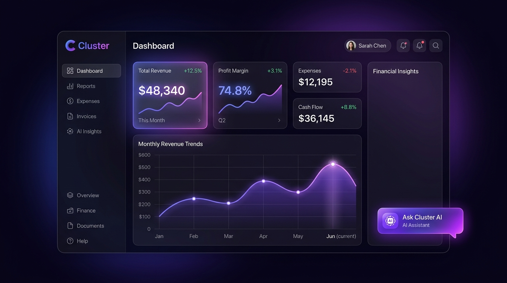

# 🌐 Cluster — AI Financial SaaS Dashboard



> **Cluster** is a competition-grade financial management and AI bookkeeping SaaS dashboard. Built as a lightweight, lightning-fast Single Page Application (SPA), it combines AI-powered financial analysis, real-time analytics, automated report generation, and a stunning Apple-inspired liquid glass UI with a rich chromatic dark mode.

---

## ✨ Features

### 🔐 Authentication
- **Google Sign-In** (Firebase OAuth)
- **Email / Password** authentication
- Protected dashboard routes — unauthenticated users are redirected to Sign Up

### 📊 Dashboard — 7 Sections
| Section | Highlights |
|---|---|
| **Overview** | Live metric cards (Revenue, Expenses, Profit, Margin), budget progress bars, recent transactions |
| **Transactions** | 28 sample entries, search + category/type filters, CSV export, pagination |
| **Analytics** | Chart.js — Revenue vs Expenses bar chart, Expense donut chart, Profit trend line chart |
| **Accounts** | 4 connected account cards (Chase, BofA, Fidelity) with balances and quick actions |
| **Reports** | 6 report types, date range picker, format selector (CSV/PDF/XLSX), real file downloads |
| **Profile** | Editable name/email/company/phone/bio synced to Firestore, avatar, password reset |
| **Settings** | Dark/Light toggle, currency, 5 notification toggles, 2FA, Gemini API key config |

### 🤖 AI Chat — Powered by Google Gemini 1.5 Flash
- Real API calls with your financial data as system context
- Markdown-rendered responses (bold, bullets, code, links)
- 10-message conversation memory
- Graceful error handling (invalid key, rate limit, network)

### 🎨 Design System
- **Apple Liquid Glass** — `backdrop-filter: blur(24px) saturate(180%)` on every surface
- **Rich Dark Mode** — Deep violet-black (`#07060f`) with layered indigo/purple radial gradient blooms
- **Per-Section Chromatic Accents** — Each section has its own distinct color identity
- **Spring Animations** — `cubic-bezier(.34,1.56,.64,1)` on every hover/interaction
- **Inter font** from Google Fonts

---

## 🛠️ Tech Stack

| Layer | Technology |
|---|---|
| Frontend | Vanilla HTML5, CSS3, JavaScript (ES Modules) |
| Auth | Firebase Authentication (Google + Email/Password) |
| Database | Firebase Firestore |
| Charts | Chart.js |
| AI | Google Gemini 1.5 Flash API |
| Design | Glassmorphism, CSS Custom Properties, CSS Animations |

---

## 🚀 Getting Started

### 1. Clone the repository
```bash
git clone https://github.com/Avijit010325/cluster_finance_dashboard.git
cd cluster_finance_dashboard
```

### 2. Serve locally
```bash
python3 -m http.server 3000
# Open http://localhost:3000
```

### 3. Configure Firebase
The app uses Firebase for Auth and Firestore. The config is embedded in `index.html`. To use your own Firebase project:
1. Go to [Firebase Console](https://console.firebase.google.com/)
2. Create a new project → Enable Authentication (Google + Email/Password)
3. Enable Firestore Database
4. Replace the `firebaseConfig` object in `index.html`
5. Add `localhost` to your Firebase authorized domains

### 4. Set up Gemini AI (Optional)
1. Get a free API key at [aistudio.google.com](https://aistudio.google.com/)
2. Open the app → Dashboard → Settings → 🤖 AI Configuration
3. Paste your key (starts with `AIza...`) and click **💾 Save Key**
4. AI Chat is now live!

---

## 📁 Project Structure

```
cluster_finance_dashboard/
├── index.html      # Full SPA — all views, logic, Firebase, Chart.js
├── styles.css      # Premium design system — tokens, glass, animations
└── banner.jpg      # Project banner
```

---

## 📸 Preview


---

## 📄 License

MIT License — free to use, modify, and distribute.

---

<p align="center">Built with ❤️ by <a href="https://github.com/Avijit010325">Avijit Aditya</a></p>
